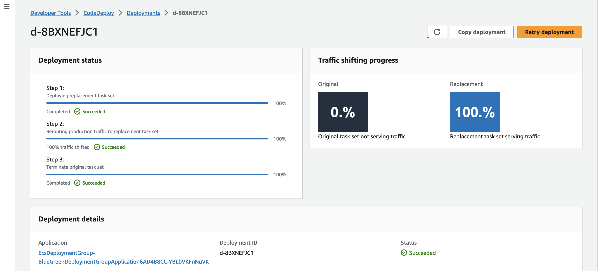

## Introduction

[GitHub](https://github.com/entest-hai/ecs-chatbot-app/tree/master) this project shows how to build a chatbot and deploy it on amazon ecs. Here are main components

- [video demo](https://d2cvlmmg8c0xrp.cloudfront.net/mp4/chatbot-app-demo-1.mp4)
- vercel ai sdk and hugging face model
- deploy the web app using cdk
- codepipeline blue/green deploy ecs

[](https://d2cvlmmg8c0xrp.cloudfront.net/mp4/ecs-chatbot-app-part-2.mp4)

> [!WARNING]
>
> - Tested with "aws-cdk-lib": "2.93.0"
> - Need to use taskdef.json, appspec.yaml and iamgeDetail.json
> - Pull image from docker hub might experience rate limit

## Setup Project

Let create a new folder for the project

```bash
mkdir ecs-chatbot-app
```

Then init a new CDK project in typescript

```bash
cdk init --l typescript
```

Next, create a new nextjs project in chatbot-app folder

```bash
npx create-next-app@latest chatbot-app
```

Go into the chatbot-app folder and install some dependencies

```bash
npm install ai
```

Finally the project structure looks like this

```
|--bin
|--lib
|--chatbot-app
|--test
|--cdk.out
|--node_modules
|--cdk.context.json
|--cdk.json
|--jest.config.js
|--package-lock.json
|--package.json
|--README.md
|--tsconfig.json
|--appspec.yaml
|--taskdef.json
```

## Build Chatbot

Prerequisites: you have to create a Hugging Face token [here]()

Let go int the directory chatbot-app and create a new nextjs project

```bash
npx create-next-app@latest
```

Then install dependencies

```bash
npm install ai openai @huggingface/inference clsx lucide-react
```

Store your Hugging Face token in .env

```bash
OPENAI_API_KEY=xxxxxxxxx
```

The nextjs project has a project structure as below

```
|--chatbot-app
   |--app
      |--api
         |--route.ts
      |--global.css
      |--icons.tsx
      |--layout.tsx
      |--page.tsx
    |--public
    |--.env
    |--.eslintrc.json
    |--Dockerfile
    |--next.config.js
    |--package-lock.json
    |--package.json
    |--postcss.config.js
    |--tailwind.config.ts
    |--tsconfig.json
```

## Build ECS Stack

> [!IMPORTANT]
> For ECS Blue/Green deployment, we need to use a CodeDeploy Deployment Group. Basically, we need to setup

- An application load balancer
- Two target groups (Blue and Green)
- Create an ECS cluster and a service
- Attach the glue target group with the service

Create an Amazon ECS Cluster and a service for the chatbot app in lib/ecs-stack.ts as the following

```ts
interface EcsProps extends StackProps {
  vpcId: string;
  vpcName: string;
  ecrRepoName: string;
}

export class EcsBlueGreenStack extends Stack {
  public readonly service: aws_ecs.FargateService;
  public readonly listener: aws_elasticloadbalancingv2.ApplicationListener;
  public readonly blueTargetGroup: aws_elasticloadbalancingv2.ApplicationTargetGroup;
  public readonly greenTargetGroup: aws_elasticloadbalancingv2.ApplicationTargetGroup;

  constructor(scope: Construct, id: string, props: EcsProps) {
    super(scope, id, props);

    // lookup an existed vpc
    const vpc = aws_ec2.Vpc.fromLookup(this, "LookUpVpc", {
      vpcId: props.vpcId,
      vpcName: props.vpcName,
    });

    // application load balancer
    const alb = new aws_elasticloadbalancingv2.ApplicationLoadBalancer(
      this,
      "AlbForEcs",
      {
        loadBalancerName: "AlbForEcsDemo",
        vpc: vpc,
        internetFacing: true,
      }
    );

    // add product listener
    const prodListener = alb.addListener("ProdListener", {
      port: 80,
      open: true,
      protocol: aws_elasticloadbalancingv2.ApplicationProtocol.HTTP,
    });

    const testListener = alb.addListener("TestListener", {
      port: 8080,
      open: true,
      protocol: aws_elasticloadbalancingv2.ApplicationProtocol.HTTP,
    });

    prodListener.connections.allowDefaultPortFromAnyIpv4("");
    testListener.connections.allowDefaultPortFromAnyIpv4("");

    // blue target group
    const blueTargetGroup =
      new aws_elasticloadbalancingv2.ApplicationTargetGroup(
        this,
        "GlueTargetGroup",
        {
          targetType: aws_elasticloadbalancingv2.TargetType.IP,
          port: 80,
          healthCheck: {
            timeout: Duration.seconds(20),
            interval: Duration.seconds(35),
            path: "/",
            protocol: aws_elasticloadbalancingv2.Protocol.HTTP,
          },
          vpc: vpc,
        }
      );

    // green target group
    const greenTargetGroup =
      new aws_elasticloadbalancingv2.ApplicationTargetGroup(
        this,
        "GreenTargetGroup",
        {
          targetType: aws_elasticloadbalancingv2.TargetType.IP,
          healthCheck: {
            timeout: Duration.seconds(20),
            interval: Duration.seconds(35),
            path: "/",
            protocol: aws_elasticloadbalancingv2.Protocol.HTTP,
          },
          port: 80,
          vpc: vpc,
        }
      );

    prodListener.addTargetGroups("GlueTargetGroup", {
      targetGroups: [blueTargetGroup],
    });

    testListener.addTargetGroups("GreenTargetGroup", {
      targetGroups: [greenTargetGroup],
    });

    // ecs cluster
    const cluster = new aws_ecs.Cluster(this, "EcsClusterForWebServer", {
      vpc: vpc,
      clusterName: "EcsClusterForWebServer",
      containerInsights: true,
      enableFargateCapacityProviders: true,
    });

    // task role pull ecr image
    const executionRole = new aws_iam.Role(
      this,
      "RoleForEcsTaskToPullEcrChatbotImage",
      {
        assumedBy: new aws_iam.ServicePrincipal("ecs-tasks.amazonaws.com"),
        roleName: "RoleForEcsTaskToPullEcrChatbotImage",
      }
    );

    executionRole.addToPolicy(
      new aws_iam.PolicyStatement({
        effect: Effect.ALLOW,
        actions: ["ecr:*"],
        resources: ["*"],
      })
    );

    // ecs task definition
    const task = new aws_ecs.FargateTaskDefinition(
      this,
      "TaskDefinitionForWeb",
      {
        family: "latest",
        cpu: 2048,
        memoryLimitMiB: 4096,
        runtimePlatform: {
          operatingSystemFamily: aws_ecs.OperatingSystemFamily.LINUX,
          cpuArchitecture: aws_ecs.CpuArchitecture.X86_64,
        },
        // taskRole: "",
        // retrieve container images from ECR
        executionRole: executionRole,
      }
    );

    // taask add container
    task.addContainer("NextChatbotContainer", {
      containerName: "entest-chatbot-app",
      memoryLimitMiB: 4096,
      memoryReservationMiB: 4096,
      stopTimeout: Duration.seconds(120),
      startTimeout: Duration.seconds(120),
      environment: {
        FHR_ENV: "DEPLOY",
      },
      image: aws_ecs.ContainerImage.fromRegistry(
        "public.ecr.aws/b5v7e4v7/entest-chatbot-app:latest"
      ),
      // image: aws_ecs.ContainerImage.fromEcrRepository(
      //   aws_ecr.Repository.fromRepositoryName(
      //     this,
      //     "entest-chatbot-app",
      //     props.ecrRepoName
      //   )
      // ),
      portMappings: [{ containerPort: 3000 }],
    });

    // service
    const service = new aws_ecs.FargateService(this, "ChatbotService", {
      vpcSubnets: {
        subnetType: aws_ec2.SubnetType.PUBLIC,
      },
      assignPublicIp: true,
      cluster: cluster,
      taskDefinition: task,
      desiredCount: 2,
      deploymentController: {
        type: aws_ecs.DeploymentControllerType.CODE_DEPLOY,
      },
      capacityProviderStrategies: [
        {
          capacityProvider: "FARGATE",
          weight: 1,
        },
        {
          capacityProvider: "FARGATE_SPOT",
          weight: 0,
        },
      ],
      platformVersion: FargatePlatformVersion.LATEST,
    });

    // attach service to target group
    service.connections.allowFrom(alb, aws_ec2.Port.tcp(80));
    service.connections.allowFrom(alb, aws_ec2.Port.tcp(8080));
    service.attachToApplicationTargetGroup(blueTargetGroup);

    // exported
    this.service = service;
    this.listener = prodListener;
    this.blueTargetGroup = blueTargetGroup;
    this.greenTargetGroup = greenTargetGroup;
  }
}
```

## Deployment Group

The deployment group from CodeDeploy will handle the Blue/Green deployment with configuration and strategry for routing traffice such as ALL_AT_ONCE, CANARY.

```ts
interface EcsDeploymentProps extends StackProps {
  service: aws_ecs.FargateService;
  blueTargetGroup: aws_elasticloadbalancingv2.ApplicationTargetGroup;
  greenTargetGroup: aws_elasticloadbalancingv2.ApplicationTargetGroup;
  listener: aws_elasticloadbalancingv2.ApplicationListener;
}

export class EcsDeploymentGroup extends Stack {
  public readonly deploymentGroup: aws_codedeploy.EcsDeploymentGroup;

  constructor(scope: Construct, id: string, props: EcsDeploymentProps) {
    super(scope, id, props);

    const service = props.service;
    const blueTargetGroup = props.blueTargetGroup;
    const greenTargetGroup = props.greenTargetGroup;
    const listener = props.listener;

    this.deploymentGroup = new aws_codedeploy.EcsDeploymentGroup(
      this,
      "BlueGreenDeploymentGroup",
      {
        service: service,
        blueGreenDeploymentConfig: {
          blueTargetGroup,
          greenTargetGroup,
          listener,
        },
        deploymentConfig: aws_codedeploy.EcsDeploymentConfig.ALL_AT_ONCE,
      }
    );
  }
}
```

## Build CI/CD Pipeline

> [!IMPORTANT]
> Please pay attention to taskdef.json, appspec.yaml and imageDetail.json

Let create a CI/CD pipeline for deploying the chatbot app continuously as the following

```ts
interface CodePipelineBlueGreenProps extends StackProps {
  readonly connectArn?: string;
  readonly repoName: string;
  readonly repoBranch: string;
  readonly repoOwner: string;
  readonly ecrRepoName: string;
  readonly service: aws_ecs.FargateService;
  readonly deploymentGroup: aws_codedeploy.EcsDeploymentGroup;
}

export class CodePipelineBlueGreen extends Stack {
  constructor(scope: Construct, id: string, props: CodePipelineBlueGreenProps) {
    super(scope, id, props);

    // code commit
    const codecommitRepository = new aws_codecommit.Repository(
      this,
      "CodeCommitChatbot",
      {
        repositoryName: props.repoName,
      }
    );

    const ecrRepository = aws_ecr.Repository.fromRepositoryName(
      this,
      "EcrRepositoryForChatbot",
      props.ecrRepoName
    );

    // artifact - source code
    const sourceOutput = new aws_codepipeline.Artifact("SourceOutput");

    // artifact - codebuild output
    const codeBuildOutput = new aws_codepipeline.Artifact("CodeBuildOutput");

    // codebuild role push ecr image
    const codebuildRole = new aws_iam.Role(this, "RoleForCodeBuildChatbotApp", {
      roleName: "RoleForCodeBuildChatbotApp",
      assumedBy: new aws_iam.ServicePrincipal("codebuild.amazonaws.com"),
    });

    ecrRepository.grantPullPush(codebuildRole);

    // codebuild - build ecr image
    const ecrBuild = new aws_codebuild.PipelineProject(
      this,
      "BuildChatbotEcrImage",
      {
        projectName: "BuildChatbotEcrImage",
        role: codebuildRole,
        environment: {
          privileged: true,
          buildImage: aws_codebuild.LinuxBuildImage.STANDARD_5_0,
          computeType: aws_codebuild.ComputeType.MEDIUM,
          environmentVariables: {
            ACCOUNT_ID: {
              value: this.account,
              type: aws_codebuild.BuildEnvironmentVariableType.PLAINTEXT,
            },
            REGION: {
              value: this.region,
              type: aws_codebuild.BuildEnvironmentVariableType.PLAINTEXT,
            },
            REPO_NAME: {
              value: props.ecrRepoName,
              type: aws_codebuild.BuildEnvironmentVariableType.PLAINTEXT,
            },
            TAG: {
              value: "demo",
              type: aws_codebuild.BuildEnvironmentVariableType.PLAINTEXT,
            },
          },
        },

        // cdk upload build_spec.yaml to s3
        buildSpec: aws_codebuild.BuildSpec.fromAsset(
          path.join(__dirname, "./build_spec.yaml")
        ),
      }
    );

    // code pipeline
    new aws_codepipeline.Pipeline(this, "CodePipelineChatbot", {
      pipelineName: "CodePipelineChatbot",
      // cdk automatically creates role for codepipeline
      // role: pipelineRole,
      stages: [
        // source
        {
          stageName: "SourceCode",
          actions: [
            new aws_codepipeline_actions.CodeCommitSourceAction({
              actionName: "CodeCommitChatbot",
              repository: codecommitRepository,
              branch: "main",
              output: sourceOutput,
            }),
          ],
        },

        // build docker image and push to ecr
        {
          stageName: "BuildChatbotEcrImageStage",
          actions: [
            new aws_codepipeline_actions.CodeBuildAction({
              actionName: "BuildChatbotEcrImage",
              project: ecrBuild,
              input: sourceOutput,
              outputs: [codeBuildOutput],
            }),
          ],
        },
        {
          stageName: "EcsCodeDeployBlueGreen",
          actions: [
            new aws_codepipeline_actions.CodeDeployEcsDeployAction({
              actionName: "EcsDeployGlueGreen",
              deploymentGroup: props.deploymentGroup,
              // file name shoulde be appspec.yaml
              appSpecTemplateInput: sourceOutput,
              // update task definition
              containerImageInputs: [
                {
                  // should contain imageDetail.json
                  input: codeBuildOutput,
                  taskDefinitionPlaceholder: "IMAGE1_NAME",
                },
              ],
              // should be taskdef.json
              taskDefinitionTemplateInput: sourceOutput,
              // variablesNamespace: ''
            }),
          ],
        },
      ],
    });
  }
}
```

> [!IMPORTANT]
> CDK automatically create role for codebuild, codedeploy, and codepipeline. Below is the content of the iam policy generated for codepipeline role. The codepline role will assume on of three different role for codebuild action, ecsdeploy action, and source action.

```json
{
  "Version": "2012-10-17",
  "Statement": [
    {
      "Action": [
        "s3:Abort*",
        "s3:DeleteObject*",
        "s3:GetBucket*",
        "s3:GetObject*",
        "s3:List*",
        "s3:PutObject",
        "s3:PutObjectLegalHold",
        "s3:PutObjectRetention",
        "s3:PutObjectTagging",
        "s3:PutObjectVersionTagging"
      ],
      "Resource": [
        "arn:aws:s3:::artifact-bucket-name",
        "arn:aws:s3:::artifact-bucket-name/*"
      ],
      "Effect": "Allow"
    },
    {
      "Action": [
        "kms:Decrypt",
        "kms:DescribeKey",
        "kms:Encrypt",
        "kms:GenerateDataKey*",
        "kms:ReEncrypt*"
      ],
      "Resource": "arn:aws:kms:ap-southeast-1:$ACCOUNT_ID:key/$KEY_ID",
      "Effect": "Allow"
    },
    {
      "Action": "sts:AssumeRole",
      "Resource": [
        "arn:aws:iam::$ACCOUNT_ID:role/CodePipelineChatbotBuildC-9DSS5JG1VE7T",
        "arn:aws:iam::$ACCOUNT_ID:role/CodePipelineChatbotEcsCod-AO6ZDE82ELPC",
        "arn:aws:iam::$ACCOUNT_ID:role/CodePipelineChatbotSource-1SZLHE9CFAAXO"
      ],
      "Effect": "Allow"
    }
  ]
}
```

## CDK Deploy

Let create a CDK app in bin/aws-ecs-demo.ts as below. It is possible to use either an existing VPC or creating a new VPC for the ECS cluster.

```ts
#!/usr/bin/env node
import * as cdk from "aws-cdk-lib";
import { EcrStack } from "../lib/ecr-stack";
import { EcsBlueGreenStack } from "../lib/ecs-blue-green-stack";
import { EcsDeploymentGroup } from "../lib/ecs-blue-green-stack";
import { CodePipelineBlueGreen } from "../lib/ecs-blue-green-stack";

const app = new cdk.App();

// create an ecr repository
const ecr = new EcrStack(app, "EcrStack", {
  repoName: "entest-chatbot-app",
});

// create an ecs blue green
const ecs = new EcsBlueGreenStack(app, "EcsBlueGreenStack", {
  vpcId: "vpc-0c8e39fd00db3261f",
  vpcName: "RedshiftVpc",
  ecrRepoName: ecr.repoName,
  env: {
    region: process.env.CDK_DEFAULT_REGION,
    account: process.env.CDK_DEFAULT_ACCOUNT,
  },
});

// codedeploy deployment group
const deploy = new EcsDeploymentGroup(app, "EcsDeploymentGroup", {
  service: ecs.service,
  blueTargetGroup: ecs.blueTargetGroup,
  greenTargetGroup: ecs.greenTargetGroup,
  listener: ecs.listener,
  env: {
    region: process.env.CDK_DEFAULT_REGION,
    account: process.env.CDK_DEFAULT_ACCOUNT,
  },
});

// create a pipeline
new CodePipelineBlueGreen(app, "CodePipelineBlueGreen", {
  repoName: "ecs-chatbot-app",
  repoBranch: "master",
  repoOwner: "entest-hai",
  ecrRepoName: ecr.repoName,
  service: ecs.service,
  deploymentGroup: deploy.deploymentGroup,
  env: {
    region: process.env.CDK_DEFAULT_REGION,
    account: process.env.CDK_DEFAULT_ACCOUNT,
  },
});
```

First, we need to deploy the ECR repository

```bash
cdk deploy EcrStack
```

Second, build an image locally and push to the ecr respository using /chatbot-app/build.py

```bash
python3 build.py
```

Third, deploy an ECS cluster with a service using the image above

```bash
cdk deploy EcsBlueGreenStack
```

Finally, we create a ci/cd pipeline for automatically build and deploy the latest container image tag

```bash
cdk deploy CodepipelineBlueGreen
```

:smile:

## Referece

- [aws docs ecs standard](https://docs.aws.amazon.com/codepipeline/latest/userguide/ecs-cd-pipeline.html)

- [aws docs ecs blue green](https://docs.aws.amazon.com/codepipeline/latest/userguide/tutorials-ecs-ecr-codedeploy.html)

- [aws docs ecs](https://docs.aws.amazon.com/codedeploy/latest/userguide/tutorial-ecs-deployment.html)

- [ecs task and execution role](https://docs.aws.amazon.com/AmazonECS/latest/developerguide/task_definition_parameters.html)

- [AmazonEC2ContainerRegistryPowerUser](https://docs.aws.amazon.com/codepipeline/latest/userguide/ecs-cd-pipeline.html)

- [vercel ai sdk](https://sdk.vercel.ai/docs/guides/providers/hugging-face)

- [github markdown guide](https://docs.github.com/en/get-started/writing-on-github/getting-started-with-writing-and-formatting-on-github/basic-writing-and-formatting-syntax)

- [aws ecs blue green pipeline](https://docs.aws.amazon.com/codepipeline/latest/userguide/tutorials-ecs-ecr-codedeploy.html)

- [imageDetail.json](https://docs.aws.amazon.com/codepipeline/latest/userguide/file-reference.html#file-reference-ecs-bluegreen)
